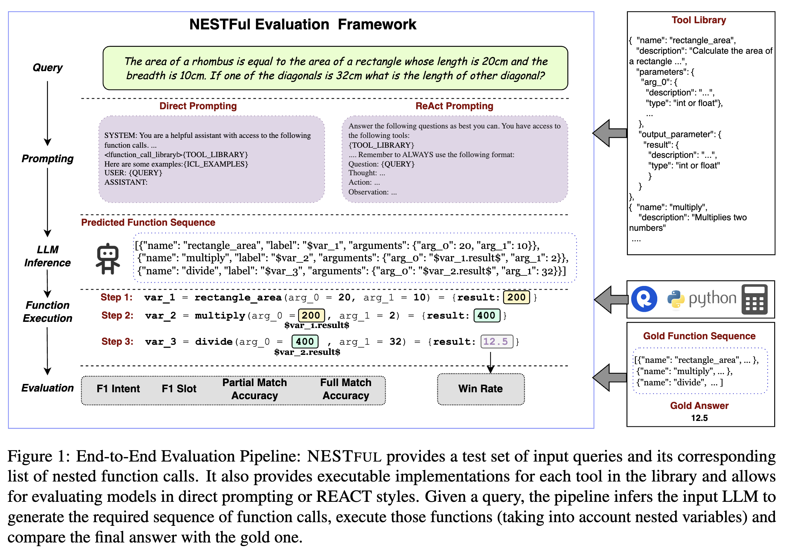
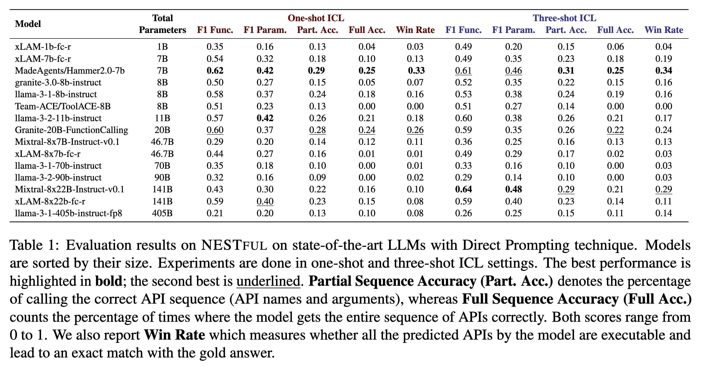

# NESTFUL: Nested Function-Calling Dataset

<div>
<a width="150" style="display: inline-block" href="https://arxiv.org/abs/2409.03797v3"></a>
<a width="150" style="display: inline-block" href="https://github.com/IBM/NESTFUL"></a>
</div>

NESTFUL is a benchmark to evaluate LLMs on nested sequences of API calls, i.e., sequences where the output of one API call is passed as input to
a subsequent call.
The NESTFUL dataset includes over 1800 nested sequences from two main areas: mathematical reasoning and coding tools. The mathematical reasoning portion is generated from 
the [MathQA](https://huggingface.co/datasets/allenai/math_qa) dataset, while the coding portion is generated from the
[StarCoder2-Instruct](https://huggingface.co/datasets/bigcode/self-oss-instruct-sc2-exec-filter-50k) dataset.
All function calls in the dataset are executable. Please refer to the [paper](https://arxiv.org/abs/2409.03797v2) for more details.


<div style="text-align: center;">
    
</div>


## Data Structure

The dataset contains the following fields:

1. `sample_id (str)`: A unique ID for each sample in the dataset
2. `input (str)`: The user query that needs to be answered by the model using function calls
3. `tools (list[dict])`: A catalog of tools available to the model for the corresponding query
4. `output (list[dict])`: The ground truth sequence of functions to answer the user query
5. `gold_answer`: The final answer upon executing the ground truth function calls.

*Note: Columns `tools`, `output`, and `gold_answer` are formatted as string, but they can be reformatted to the original type using `json.loads` for `tools` and `output` and `eval` for the `gold_answer` field.* 

**Executable Functions:** To get the executable functions, please go to the GitHub  Repo at: https://github.com/IBM/NESTFUL/tree/main/data_v2/executable_functions

## Data sample

In the example shown below (tools list is truncated for brevity), each element of the `output` list is a function call. Each function call assigns a `label` to the output of that function, for example `"label": "$var_1"`. To refer the output of a previous function in the current function call, the argument value is specified as `${label_name}.{variable_name}$`, for example: `"arg_1": "$var_2.result$"`.

<details>
  <summary>Expand to see the data sample</summary>

  ```json
{
    "sample_id": "4af7a62d-58fd-431f-a11f-eff486e10987",
    "input": "find the average of all the number between 6 and 34 which are divisible by 5.",
    "tools": [
        {
            "name": "inverse",
            "description": "Return the inverse (reciprocal) of a number",
            "parameters": {
                "arg_0": {
                    "description": "The number to inverse",
                    "type": "int or float"
                }
            },
            "output_parameter": {
                "result": {
                    "description": "The inverse result",
                    "type": "int or float"
                }
            }
        },
        ...
    ],
    "output": [
        {
            "name": "add",
            "label": "$var_1",
            "arguments": {
                "arg_0": 6,
                "arg_1": 4
            }
        },
        {
            "name": "subtract",
            "label": "$var_2",
            "arguments": {
                "arg_0": 34,
                "arg_1": 4
            }
        },
        {
            "name": "add",
            "label": "$var_3",
            "arguments": {
                "arg_0": "$var_1.result$",
                "arg_1": "$var_2.result$"
            }
        },
        {
            "name": "divide",
            "label": "$var_4",
            "arguments": {
                "arg_0": "$var_3.result$",
                "arg_1": 2
            }
        }
    ],
    "gold_answer": 20.0
}
```

</details>


## Benchmark results

We evaluated NESTFUL using 15 open-source models with sizes varying from 1B up to 405B parameters. We observe that the best function calling models have low performance numbers, indicating the complexity of the nested sequencing problem. Common issues with the models include: Difficulty assigning variables, Failing to utilize output parameter details from API specifications, Incorrectly passing variable names and output parameters to subsequent APIs.


<div style="text-align: center;">
    
</div>


## Citation

```bibtex
@article{basu2024nestful,
  title={NESTFUL: A Benchmark for Evaluating LLMs on Nested Sequences of API Calls},
  author={Basu, Kinjal and Abdelaziz, Ibrahim and Kate, Kiran and Agarwal, Mayank and Crouse, Maxwell and Rizk, Yara and Bradford, Kelsey and Munawar, Asim and Kumaravel, Sadhana and Goyal, Saurabh and others},
  journal={arXiv preprint arXiv:2409.03797},
  year={2024}
}
```