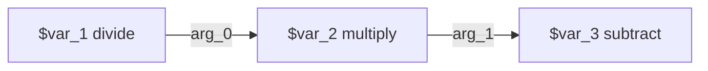
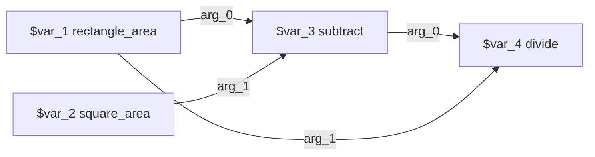
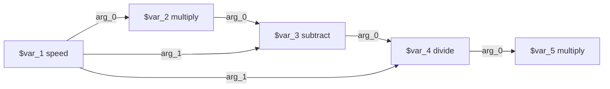
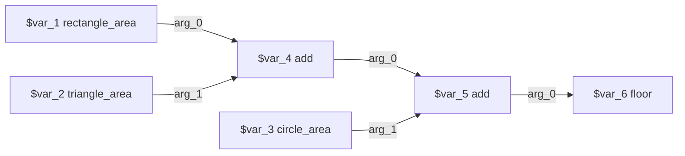
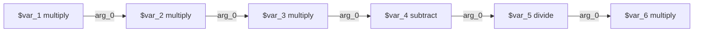
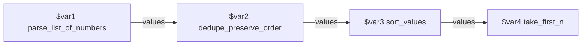
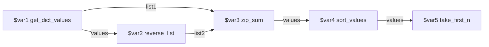
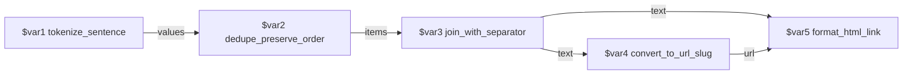
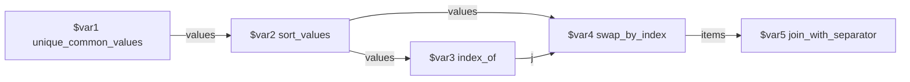
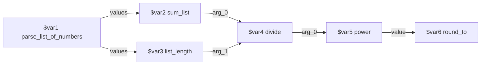

# Synthetic NESTFUL-style tasks - call graphs

Generated by `build_dataset.py`. Each task was produced graph-first: the DAG below was written and executed, and only then was the query written to fit it.

## syn-001 - chain (depth 3, width 1)

`07486183-d215-5d66-b8f4-fd9d8cb8db81` | family **math** | 3 nodes, 2 edges, depth 3, width 1 | catalogue 10 tools (7 distractors)

**Call graph**



**Query (authored from the executed graph)**

> A print run of 640 posters is scheduled. Three eighths of the run come off the press before the ink cartridge has to be changed. How many posters are still unprinted at the moment of the change?

**Executed trace**

```
$var_1  divide                   = 0.375
$var_2  multiply                 = 240.0
$var_3  subtract                 = 400.0
```

**Gold answer** — `400.0`

## syn-002 - diamond (fan-out at n1, fan-in at n4)

`e2e3beee-d4a2-5b2a-8670-b73573b1c09b` | family **math** | 4 nodes, 4 edges, depth 3, width 2 | catalogue 11 tools (7 distractors)

**Call graph**



**Query (authored from the executed graph)**

> A workshop floor measures 14 metres by 9 metres. A square machine footprint with 6-metre sides is bolted down in the middle of it. What fraction of the floor area is still free?

**Executed trace**

```
$var_1  rectangle_area           = 126
$var_2  square_area              = 36
$var_3  subtract                 = 90
$var_4  divide                   = 0.7142857142857143
```

**Gold answer** — `0.7142857142857143`

## syn-003 - fan-out star (n1 feeds 3 consumers) + chain

`ff08e866-bfd9-5850-8c94-f9a4c40f6910` | family **math** | 5 nodes, 6 edges, depth 5, width 1 | catalogue 12 tools (8 distractors)

**Call graph**



**Query (authored from the executed graph)**

> A delivery van covers 240 km in 3 hours on the way out. On the return leg the driver averages 1.25 times the outbound speed. By what percentage is the return speed higher than the outbound speed?

**Executed trace**

```
$var_1  speed                    = 80.0
$var_2  multiply                 = 100.0
$var_3  subtract                 = 20.0
$var_4  divide                   = 0.25
$var_5  multiply                 = 25.0
```

**Gold answer** — `25.0`

## syn-004 - convergent tree (3 roots, width 3, depth 4)

`7067b2b2-49ce-5d3f-87c4-973f74572b2e` | family **math** | 6 nodes, 5 edges, depth 4, width 3 | catalogue 13 tools (8 distractors)

**Call graph**



**Query (authored from the executed graph)**

> A stage designer cuts three panels out of one sheet of board: a rectangle 12 by 5, a triangle with base 10 and height 6, and a circle of radius 2.0. Working in whole square units and discarding any leftover fraction, how many square units of board do the three panels take up together?

**Executed trace**

```
$var_1  rectangle_area           = 60
$var_2  triangle_area            = 30.0
$var_3  circle_area              = 12.566370614359172
$var_4  add                      = 90.0
$var_5  add                      = 102.56637061435917
$var_6  floor                    = 102
```

**Gold answer** — `102`

## syn-005 - deep chain (depth 6, width 1)

`d0dca7cb-b2a3-5ebb-a95b-1c814115e80a` | family **math** | 6 nodes, 5 edges, depth 6, width 1 | catalogue 12 tools (9 distractors)

**Call graph**



**Query (authored from the executed graph)**

> A fund of 2500 grows by a factor of 1.08 in each of three consecutive years. By what percentage is the fund larger at the end of the third year than it was at the start?

**Executed trace**

```
$var_1  multiply                 = 2700.0
$var_2  multiply                 = 2916.0
$var_3  multiply                 = 3149.28
$var_4  subtract                 = 649.2800000000002
$var_5  divide                   = 0.25971200000000005
$var_6  multiply                 = 25.971200000000007
```

**Gold answer** — `25.971200000000007`

## syn-006 - chain (depth 4) with type changes string->array->array

`c8d51c00-1781-5f70-924a-604f128be49f` | family **code** | 4 nodes, 3 edges, depth 4, width 1 | catalogue 14 tools (10 distractors)

**Call graph**



**Query (authored from the executed graph)**

> This shift's sensor log arrived as the raw string "18, 7, 42, 7, 23, 42, 5". Pull the numbers out of it, drop any reading that repeats an earlier one, and give me the three highest readings, largest first.

**Executed trace**

```
$var1   parse_list_of_numbers    = [18, 7, 42, 7, 23, 42, 5]
$var2   dedupe_preserve_order    = [18, 7, 42, 23, 5]
$var3   sort_values              = [42, 23, 18, 7, 5]
$var4   take_first_n             = [42, 23, 18]
```

**Gold answer** — `[42, 23, 18]`

## syn-007 - diamond (n1 reaches n3 by two disjoint paths)

`26a6a8b2-8181-57b5-8fa9-53b94d173e48` | family **code** | 5 nodes, 5 edges, depth 5, width 1 | catalogue 15 tools (10 distractors)

**Call graph**



**Query (authored from the executed graph)**

> I have four daily load figures: {"mon": 62, "tue": 48, "wed": 71, "thu": 39}. Take the figures in order and add each one to the figure sitting in the mirrored position of the same list, so the first pairs with the last, the second with the second-to-last, and so on. Give me the two largest of those pair totals.

**Executed trace**

```
$var1   get_dict_values          = [62, 48, 71, 39]
$var2   reverse_list             = [39, 71, 48, 62]
$var3   zip_sum                  = [101, 119, 119, 101]
$var4   sort_values              = [119, 119, 101, 101]
$var5   take_first_n             = [119, 119]
```

**Gold answer** — `[119, 119]`

## syn-008 - diamond on strings (n3 fans out to n4 and n5)

`029f469f-29dc-5016-8f68-3d7e6d415a1f` | family **code** | 5 nodes, 5 edges, depth 5, width 1 | catalogue 14 tools (9 distractors)

**Call graph**



**Query (authored from the executed graph)**

> The article is titled "Nested API Calls, Nested API Planning!". Normalise it into lowercase words with the punctuation stripped, drop any word that has already appeared, and join what is left back into a single space-separated display title. Derive a URL slug from that display title, then give me the finished HTML anchor tag that links the display title to the slug.

**Executed trace**

```
$var1   tokenize_sentence        = ['nested', 'api', 'calls', 'nested', 'api', 'planning']
$var2   dedupe_preserve_order    = ['nested', 'api', 'calls', 'planning']
$var3   join_with_separator      = 'nested api calls planning'
$var4   convert_to_url_slug      = 'nested-api-calls-planning'
$var5   format_html_link         = '<a href="nested-api-calls-planning">nested api calls planning</a>'
```

**Gold answer** — `'<a href="nested-api-calls-planning">nested api calls planning</a>'`

## syn-009 - fan-out where a computed index becomes an argument

`f7763f41-f8bb-5f82-93ad-34a2a78440a8` | family **code** | 5 nodes, 5 edges, depth 5, width 1 | catalogue 15 tools (10 distractors)

**Call graph**



**Query (authored from the executed graph)**

> Two reviewers handed in shortlists of submission IDs: [3, 9, 14, 22, 7, 31] and [22, 5, 9, 40, 31]. Keep only the IDs that both reviewers picked, rank them from highest to lowest, then promote ID 22 to the front of that ranking by swapping it with whatever currently sits in first place. Return the final ranking as a pipe-separated string.

**Executed trace**

```
$var1   unique_common_values     = [9, 22, 31]
$var2   sort_values              = [31, 22, 9]
$var3   index_of                 = 1
$var4   swap_by_index            = [22, 31, 9]
$var5   join_with_separator      = '22|31|9'
```

**Gold answer** — `'22|31|9'`

## syn-010 - fan-out + fan-in crossing the code/math tool families

`f6280c7a-2ee0-5e8d-94dd-2a1b78e73e7e` | family **mixed** | 6 nodes, 6 edges, depth 5, width 2 | catalogue 16 tools (10 distractors)

**Call graph**



**Query (authored from the executed graph)**

> Queue lengths from the last six polls came back as the string "12, 19, 7, 24, 15, 9". Work out the mean queue length by totalling the readings and dividing by how many readings there are, then square that mean and report it rounded to 2 decimal places.

**Executed trace**

```
$var1   parse_list_of_numbers    = [12, 19, 7, 24, 15, 9]
$var2   sum_list                 = 86
$var3   list_length              = 6
$var4   divide                   = 14.333333333333334
$var5   power                    = 205.44444444444446
$var6   round_to                 = 205.44
```

**Gold answer** — `205.44`
